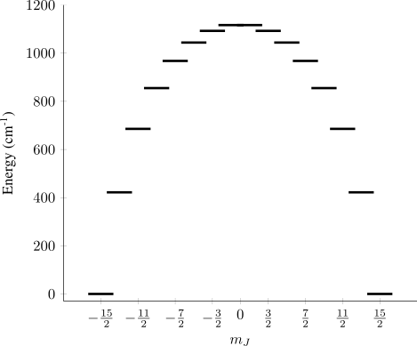

$\newcommand{\tensor}[1]{\overline{\overline{#1}}}$

Pseudospin Hamiltonians and wavefunctions are often employed in the single-molecule-magnet and qubit literature as a means of describing a small subset of a much larger group of states. This is particularly useful for a few reasons, but before delving deeper let's set out some useful starting points.

## The Zeeman effect

The magnetic moment $\vec{\mu}$ of a particle is a vector quantity and is proportional to the particle's spin $\vec{S}$, with a dimensionless proportionality constant called the $g$ value. Here we are going to consider a single isolated electron, and so we use the free electron $g$ value $g_\mathrm{e}$.

$$
\vec{\mu} = g_\mathrm{e} \mu_\mathrm{B} \vec{S}
$$

where $\mu_\mathrm{B}$ is the Bohr magneton, which is a constant that essentially accounts for the units of the magnetic moment.

Magnetic moments can interact with magnetic fields $\vec{B}$ in a process known as the Zeeman effect, and this interaction is described by the Zeeman Hamiltonian

$$
\hat{H}_\mathrm{Zeeman} = \vec{\mu}\cdot\vec{B} = g_\mathrm
{e}\mu_\mathrm{B}\hat{\vec{S}}\cdot\vec{B}
$$

where the hat denotes the operator nature of the spin. If $\vec{B}$ and $\hat{\vec{S}}$ are nown then the energies of the electronic spin states can be calculated. The vector operator $\hat{\vec{S}}$ is made up of spin operators for the three cartesian axes

$$
\hat{\vec{S}} = \left [ \hat{S}_x, \hat{S}_y, \hat{S}_z\right] \ \ ,
$$

and the field vector $\vec{B}$ has components along $x$, $y$, and $z$

$$
\vec{B} = \left [ B_x, B_y, B_z\right] \ \ ,
$$

so the dot-product in $\hat{H}_\mathrm{Zee}$ can be evaluated to give

$$
\hat{H}_\mathrm{Zeeman} = g_\mathrm{e} \mu_\mathrm{B} (\hat{S}_x B_x + \hat{S}_y B_y + \hat{S}_z B_z ) \ \ .
$$

As an example, we can define $B_x=B_y=0\neq B_z$ so that $\hat{H}_\mathrm{Zee}$ becomes

$$
\hat{H}_\mathrm{Zeeman} = g_\mathrm{e} \mu_\mathrm{B} \hat{S}_z B_z \ \ ,
$$

and from this it is trivial to obtain the (hopefully) familiar equation for the energy of the electron when its spin is aligned either with or against the magnetic field (Zeeman splitting)

$$
E = \pm\frac{g_\mathrm{e}\mu_\mathrm{B}B}{2}\\
\Delta E = g_\mathrm{e}\mu_\mathrm{B}B \ \ .
$$

But what if the system is not a free electron? Very often electronic spins are confined to molecules and ions, and so the electrons experience a variety of potentials and fields. To account for this, the $g$ value can be modified and becomes a so called *phenomenological* quantity since it describes the interaction of spin states with a field, but doesnt really explain how or why. This phenomenological usage could even be taken a step further, since experimentally one might find that $g$ changes as a function of direction, and so $g$ is more generally represented by a tensor $\tensor{g}$ which has components $g_{\alpha,\beta}$ describing the effect of an arbitrarily oriented magnetic field on a set of spin states.

$$
\tensor{g} = \begin{bmatrix}
g_{xx} & g_{xy} & g_{xz}\\
g_{yz} & g_{yy} & g_{yz}\\
g_{zx} & g_{zy} & g_{zz}\\
\end{bmatrix}
$$

So in short: **The g-tensor is a compact method for describing the effect of a magnetic field on a two level system and contains a set of values $g_{\alpha, \beta}$.**

One particularly useful feature of this (3x3) tensor is that it describes *real space*, and so it is possible to find its "principal axes" (eigenvectors), how easily the system can be magnetised along these directions, and what directions correspond to in our molecule or ion. We'll revisit this feature in a moment, but first let's pick a set of states to look at.

## Crystal Fields

The electronic structures of lanthanide qubits and SMMs are often discussed in terms of the Hund's rule ground term of the lanthanide in question. For example, Dy(III) is commonly used in SMMs and has a $^6 \mathrm{H}$ Hund's rule ground term arising from its 4f9 electron configuration. Within this term the $J=15/2$ multiplet is lowest in energy, and contains a set of 16 $m_J$ states which are degenerate in the absence of any crystal or magnetic field. When such fields are applied, this degeneracy is lifted, and in the case of the crystal field (CF), this effect can be described using a CF Hamiltonian

$$
\hat{H}_\mathrm{CF} = \sum_{k=2, 4, ..., 2J} \sum_{q=-k}^{k} \theta^k B_k^q \hat{O}_k^q
$$

where $\theta^k$ are a set of numerical factors which are constant for a given lanthanide ion, $B_k^q$ is a crystal field parameter which is unique to a given system, and $\hat{O}_k^q$ is a Stevens operator that can be calculated from the angular momentum operators $\hat{J}_i, \hat{J}^2 \ \ (i = x, y, z, +, -)$.

If we consider a (hypothetical) perfectly axial CF then $\hat{H}_\mathrm{CF}$ can be reduced to just the terms with $q=0$, and we can make a further simplification by using only terms with $k=2,4,6$. Inputting the values $B_2^0 = 1000 \ \mathrm{cm}^{-1}$, $B_4^0 = 100 \ \mathrm{cm}^{-1}$, and $B_6^0 = 10 \ \mathrm{cm}^{-1}$ into the above Hamiltonian and diagonalising the resulting matrix representation yields a set of crystal field wavefunctions $\psi_i$ with energies $E_i$ (Figure 1).

Figure 1: States of the J = 15/2 multiplet of Dy(III) in a perfectly axial crystal field.

We see that there are now 8 pairs of degenerate states (doublets) with opposite values of $m_J$. The low energy (< 1000 cm-1) doublets are well separated from each other, and so each doublet could be treated as a *pseudo* $S=1/2$ system with its own $\tensor{g}$. Then, the main magnetic axes of each doublet could be quantified and visualised, and we could start gain insight into how the molecular structure affects the electronic states.

## Finding the pseudospin g values

The question is of course, how do we find the elements of $\tensor{g}$? We could apply a magnetic field $\vec{B}$ to our CF states and record how they change as the orientation of $\vec{B}$ is varied, but this is a long and laborious process which would be at the mercy of numerical instabilities.

Instead, we can use a formula proposed by Gerloch and McMeeking which connects elements of the total magnetic moment operator $\hat{\mu}$ to the g-tensor. The total magnetic moment operator $\hat{\mu}_\alpha$ for a given direction $\alpha$ is analogous to the free electron magnetic moment operator

$$
\hat{\mu}_\alpha = g_J \mu_\mathrm{B} \hat{J}_\alpha \ .
$$

Where $\alpha$ and $\beta$ specify the cartesian directions $x$, $y$, and $z$, and the $g_\mathrm{e}$ has been replaced with the Landé g-factor $g_J$ which is a scalar that can be calculated from the $L$, $S$, and $J$ quantum numbers. Typically, these operators would be constructed in a basis of pure (or *free ion*) angular momentum states, but we're working with crystal field states which usually are not *pure*, and consist of mixtures of angular momentum states. To transform between the two, we can pre and post multiply the matrix representations of $\hat{\mu}_\alpha$ by the eigenvectors of the crystal field Hamiltonian.

So then, with the correct matrix representations of $\hat{\mu}_\alpha$ in hand, we can use Gerloch and McMeeking's formula to calculate the elements of $\tensor{g}$

$$
(g \cdot g^\mathrm{T})_{\alpha,\beta} = G_{\alpha,\beta} = \sum_{u=\psi, \psi'}\sum_{v=\psi, \psi'}\mu_{\alpha_{u,v}}\mu_{\beta_{v,u}} \ \ .
$$

Where $\psi$ and $\psi'$ are the CF wavefunctions of a given doublet. The final step is to take  $\tensor{G}$ that we've just calculated, and obtain $\tensor{g}$ from the matrix square root

$$
\tensor{G}_\mathrm{diag} = \tensor{V}^{-1}\tensor{G}\tensor{V}\\
\tensor{g} = \tensor{V}\tensor{G}_\mathrm{diag}^{1/2}\tensor{V}^{-1} \ \ ,
$$
where $\tensor{G}_\mathrm{diag}$ is a matrix containing the eigenvalues of $\tensor{G}$, and $\tensor{V}$ contains the corresponding eigenvectors.

Then, we can find obtain principal axes of the g-tensor by diagonalisation, and visualise them on top of the molecular structure (Figure 2).

The g-values are the corresponding eigenvalues, and essentially describe how easily the system is magnetised along each of the principal axes. In the case of the ground doublet these are $\left[0,0,20\right] = \left[g_x, g_y, g_z\right]$ and so a magnetic field on $x$ and $y$ will essentially have no impact on the ground doublet. Why? The strong axial CF makes the ground doublet energetically well isolated, and when coupled with its strong magnetic moment along the $z$ axis means that a very very large magnetic field along $x$ or $y$ will be required to start affecting these states.[^1]

[^1]: When the field is this large, the whole idea of a "ground doublet" is nonsense.

## Example

The following python code will calculate the g-tensors for the system illustrated in Figure 1. The only dependencies are `angmom_suite==1.10.2` and `numpy`.

